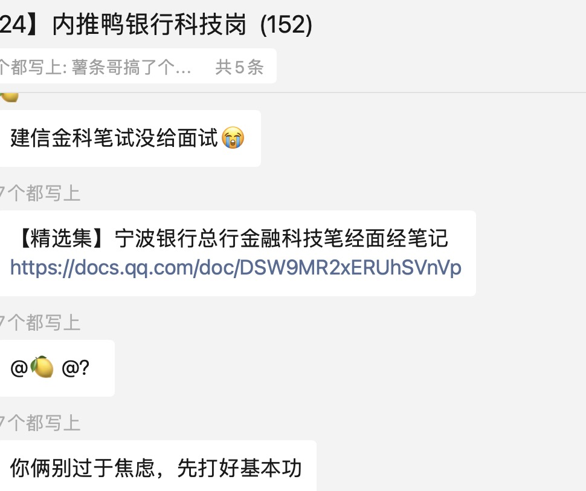
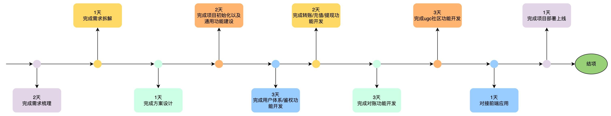

**银行科技岗必备后端项目：掌上AI银行项目（保姆级、持续更新）**

https://t.zsxq.com/onfXM， 这个星球是没有优惠
最近给大家有需要59优惠券，https://t.zsxq.com/rrOTW

# 给谁写的?
给和我一样普通的想要gobank的同学写的，因为就业环境确实慢慢变得不好，银行整体来说还是比较稳定的，年轻人先稳定稳定沉淀一下心智也没什么问题。
另外就是大家不希望花很多钱报班的人，我希望我们能够抱团取暖，本来想把这个内容的名字定义为屌丝上岸银行，但是觉得求职路上大家都是公平的。
现在是5月底，即使你是24年11月毕业的留学生也还是有很多的机会，当然我希望更多的是研二、大三的同学能看到这系列文章，因为你们时间太充沛了，通过这些内容进行准备上岸个银行就是轻轻松松，还能取做更多的选择。
对父母而言：如果你希望孩子去银行，那就可以看看第一部分的内容冲刺需知。合理评估一下你的孩子能不能上岸，能去什么样的银行。

# 能提供什么价值?
银行的求职流程，以及银行求职需要准备的内容。也为大家提供了很多笔试题目、面试经验。以及竞赛、实习技巧。
作为一个星球，他远远超过了他的价值。
我做星球的目的不单单是为了大家能够上岸银行，其实上岸银行这件事的背后有很多真实社会运转的逻辑。倘若你明白了这背后的真实求职逻辑，比上岸银行更加的有价值。
比如笔试背后是ATA这样的公司在提供服务，你知道了谁是ATA的客户，那么笔试就不会有太大的差异。
再比如你知道竞赛核心是为了招聘牛x的人，但是我们并不是牛x的人，那么我们怎么通过竞赛为我们自己赋能。
再比如好多银行培训的老师，甚至连github是什么都不知道，你觉得报个班能上岸吗？
还能提供什么?
正文的提供的全部资料都会打包给到大家
提供一个求职银行科技岗位的群，实习、竞赛、校招开启时间都会第一时间进行同步

# 春招取得结果
春招我们已经拥有了几百位用户，其中不乏往届已经上岸的同学，星球里面将会交流很多上岸的方式

体验阅读链接：[ 薯条哥银行科技岗](https://qq5jbkqzduo.feishu.cn/wiki/FA4gwhMGqiVS4wko702cNc1Mnkf?from=from_copylink)
# 一、项目介绍

> 描述项目的背景、目标和预期效果及产出

* 背景：《AI云账户系统》目是专门为银行科技岗打造，融合了金融科技岗主流的开发项目内容。包含转账、对账、充值以及提现等功能。以及后续逐步推出的AI项目。。。

* 目标：跟随本项目学习可以掌握最前沿的开发技巧，可落地的工程项目实战经验。此外针对银行科技岗位，我们还能学习到银行岗位密切关注的充值、提现、转账以及对账等实战项目，从需求挖掘、需求评审、方案设计、项目实施到最终发布上线全流程深入指导学习。帮助同学们快速熟悉企业研发全流程，然后在项目落地环节，更注重培养良好的开发习惯，注重通用能力的建设。不仅能够帮助同学们掌握银行开发中的常见案例，并且结合一线大厂的真实经验帮助同学们快速学习并掌握开发实战技巧。

* 预期效果：经过本项目学习，将掌握以下能力

    * 学会产品文档(PRD)的分析，参与需求评审，设计对应的技术方案

    * 方案设计：需求分析、流程分析、交互分析、枚举设计、数据库设计、核心接口设计等

    * 项目搭建：工程初始化，能将项目run起来，常用组件和依赖配置引入

    * 开发框架：除了常用开源框架，还会掌握实际开发中常用coomon包设计，良好的框架意识和开发习惯，以及研发痛点的业界通用解决方案

    * 核心功能开发：结合实际项目中用到的mysql、redis等来实现譬如分布式锁、缓存、分布式id等常用能力帮助完成业务代码实现。

    * 项目部署和运行：基于阿里云云效，实现在2分钟内代码变更部署完成上线。

* 相关资料：

| 资料名称        | 链接                                                                                                         |
| ----------- | ---------------------------------------------------------------------------------------------------------- |
| 产品文档(PRD)   | [ 薯条哥AI云账户系统原型图汇总](https://qq5jbkqzduo.feishu.cn/wiki/Uw55w4eufiTA4tkKc1mcBkcOnrg?fromScene=spaceOverview) |
| 技术设计文档和研发流程 | [ 薯条哥银行科技岗](https://qq5jbkqzduo.feishu.cn/wiki/FA4gwhMGqiVS4wko702cNc1Mnkf)                                |
| 前端部署文档      | https://gitee.com/zhangdaniu1997/bank-post-project-front-end                                               |

# 二、项目内容

> 涉及的内容方面，包含产品、技术、项目搭建、项目开发、项目部署；作为产品经理。。。作为后端端研发。。。

* 研发流程上：《AI云账户系统》项目包含从需求文档设计，到需求评审，方案设计，项目初始化，核心业务代码开发，部署上线全流程，帮助同学们全流程深入参与企业级开发全流程。模拟真实参与企业级日常需求研发流程，帮助同学们快人一步进入职场。

* 项目内容上：

    * 需求挖掘到形成产品文档：从产品视角了解需求

    * 基于产品文档引导掌握技术方案设计：掌握需求分析方式，梳理需求文档，专业视角设计技术方案，层层递进，完成核心功能设计

    * 核心功能开发：

        * 用户中心：包含注册/登录/鉴权，掌握用户

        * 支付转账：实现充值/提现/转账，以及对账功能开发。实战参与银行项目开发，理解融进级别安全性开发的常见技术手段。

        * 用户社区：当下社区应用非常火热，类似抖音、小红书、微博、B站等。这部分将涵盖社区发布、评论、信息流(feed)等功能开发。

        * AI报表：后续持续迭代

        * AI问答小助手集成。。。

    * 主流技术：

        * spring-boot框架：拦截器、spring-boot-starter、基于框架快速进行业务开发

        * java：threadLocal

        * mysql：表结构设计、模型抽象

        * redis：雪花算法、缓存、分布式锁

        * 业务异常统一解决方案

        * Feed信息流

        * 前端：Vue 3.0 + Vite + element-ui

    * 部署上线项目：基于阿里云生态：云效、云原生数据库RDS、云原生缓存redis、云服务器ECS等完成服务部署上线。

# 三、学习计划

## 3.1 项目时间线

## 3.2 后端文档手册

| 章节             | 主要内容                                                                                                                          |
| -------------- |-------------------------------------------------------------------------------------------------------------------------------|
| 第一章：环境准备       | 包含开发中所用到的环境，中间件，插件等必备工具配置和使用介绍。比如mysql、redis等引入，IDEA必备插件介绍，swagger引入以及常用依赖引入。                                                 |
| 第二章：项目初始化      | 基于阿里云云原生脚手架快速初始化基于spring-boot的工程框架。引入项目分层逻辑，并说明本项目使用到的分层架构。同时介绍和准备了实际项目开发中的统一异常处理逻辑以及端到端响应格式，基于约定格式统一高效处理响应逻辑，如何更专注于业务代码开发。   |
| 第三章：用户中心核心功能开发 | 结合产品文档进行分析，设计登录/注册/修改个人信息等技术文档，包含需求分析，流程设计，枚举设计，数据库设计，接口设计。此外介绍常见的后端鉴权业务解决方案，以及本项目如何实现登录后自动鉴权功能。                              |
| 第四章：银行转账核心功能开发 | 结合产品文档，分析设计转账功能相关文档，例如充值、提现、转账。并且为了交互逻辑闭环，还涉及用户信息查询、转账记录查询。其中核心转账功能引入了服务端下发token的机制防止客户端抖动导致重复提交。以及金融级别交易可靠性，引入了分布式锁，事务的使用案例。 |
| 第五章：雪花算法介绍     | 在项目中大量使用到分布式id。本项目采用雪花算法实现，从原理到代码实现，充分掌握雪花算法底层原理，以及在真实项目开发中，分布式id的使用场景。                                                       |
| 第六章：对账功能开发     | 结合转账流水，设计对账功能，并且自动将对账结果通过图表形式展现，快速分析营收和支出统计信息。后续还将继续引入AI报表功能，让对账数据通过AI大模型实现报表展示。                                              |
| 第七章：项目部署上线     | 学习如何将项目通过阿里云云效部署上线，包含流水线创建，服务器配置，一键部署发版等。                                                                                     |

